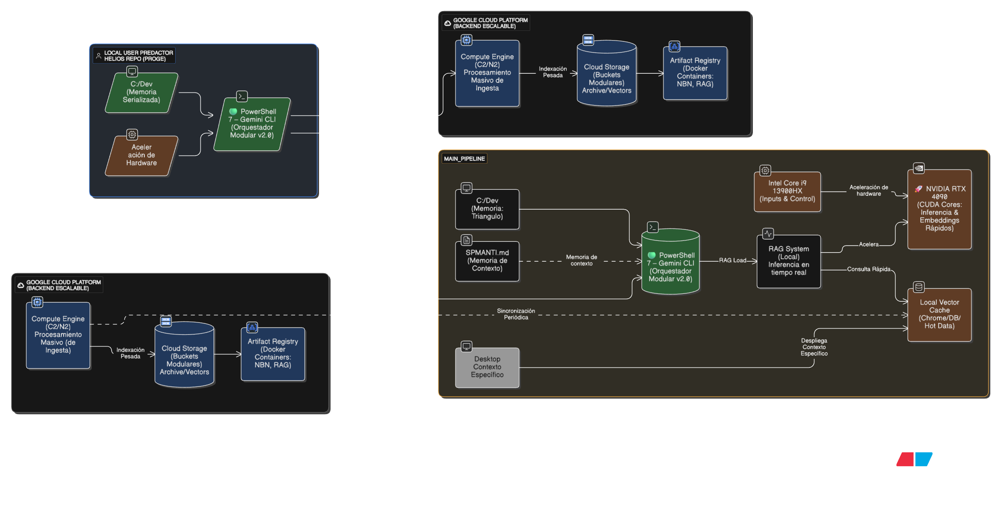

# win11-ai-orchestrator
A modular hybrid AI ecosystem for Windows 11 using PowerShell 7, Gemini API, and Google Cloud Platform for edge-cloud orchestration.

# ⚡ Win11 AI Orchestrator: Ecosistema Híbrido (Edge + Cloud)


> **Un framework modular que transforma una estación de trabajo Windows 11 en un Sistema Operativo Cognitivo, orquestando recursos locales (CUDA) y nube (Google Cloud) mediante una terminal PowerShell inteligente.**

---

## 📸 Visión General


*Panel de control v2.0 con "Lazy Loading" activo: Tiempo de carga < 1s.*

Este proyecto nace de una necesidad crítica detectada durante el desarrollo de sistemas RAG (Retrieval-Augmented Generation): **La gestión eficiente del contexto y los recursos.** En lugar de depender únicamente de soluciones en la nube o saturar la RAM local, este ecosistema implementa una **Arquitectura Híbrida** que decide dinámicamente dónde ejecutar cada tarea.

---

## 🏗️ Arquitectura del Sistema

El sistema opera bajo una filosofía de **Memoria Jerárquica** y ejecución distribuida.



### 1. Capa Local (Edge AI)
Aprovechando el hardware dedicado de una **Acer Predator Helios Neo**:
* **Orquestador:** PowerShell 7 con perfil modular. Detecta la intención del usuario y carga herramientas "on-demand" (Lazy Loading) para mantener el inicio instantáneo.
* **Inferencia Rápida:** Uso de **NVIDIA RTX 4060 (CUDA)** para vectorización de texto en tiempo real y consultas a memoria caliente (Hot Memory).
* **Sistema de Archivos:** Estructura `C:\Dev` con archivos `GEMINI.md` recursivos que dotan de "memoria espacial" a los agentes de IA.

### 2. Capa Nube (Google Cloud Platform)
Gracias al apoyo del **Google Cloud Credits Program**, se escala el procesamiento masivo:
* **Almacenamiento Vectorial:** Buckets de GCS (`Google Cloud Storage`) actúan como memoria a largo plazo segmentada por proyectos.
* **Ingesta Pesada:** Instancias de **Compute Engine** procesan gigabytes de documentación técnica para generar embeddings sin bloquear la máquina local.
* **Contenedores:** Artifact Registry para versionar los microservicios (N8N, Servidores MCP).

---

## 🚀 Características Clave

### ⚡ PowerShell Lazy Loading
El perfil de usuario no carga todos los módulos al inicio. Usa funciones "proxy" que activan el entorno solo cuando se invoca un comando:
```powershell
# Ejemplo: El módulo de Conda no toca el disco hasta que escribes 'envs'
Loading personal and system profiles took: 1058ms
